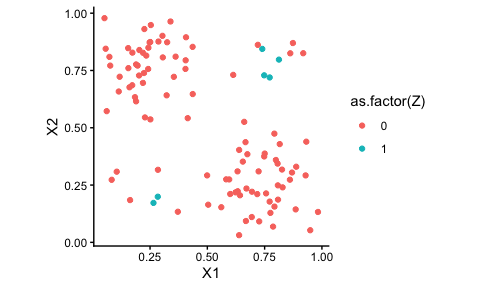
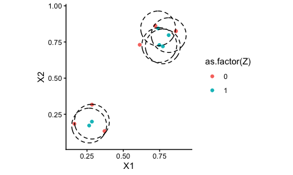

<!-- badges: start -->

<!-- badges: end -->

# Caliper Synthetic Matching (CSMatch)

This package implements the Caliper Synthetic Matching approach, which
is a blend of radius matching using distance metrics put on the
covariate distribution itself, and the synthetic control method. In
particular, it identifies sets of units local to each treated unit in
turn, and then makes a synthetic control for each treated unit using
those local units.

Details can be found on the paper: [Che et. al. (2026), Caliper
Synthetic Matching](https://arxiv.org/abs/2411.05246). This paper was
recently accepted at *Political Analyis*.

The GitHub repo has replication materials for the associated paper in
the `scripts` directory; see below for further discussion of this
added-on code. The installed package will ignore `scripts`. We also
provide [online documentation for the
package](https://miratrixcareslab.github.io/CSMatch/) on the GitHub
site.

## Installation

You can install the development version of CSMatch from
[GitHub](https://github.com/) with:

    # install.packages("devtools")  # (if needed)
    devtools::install_github("MiratrixCARESLab/CSMatch")

# Quick demo of package

Below we show a quick walk-through of some of the methods of the
package. Also see our vignette that does a more careful sample data
analysis of the Lalonde dataset, based off the primary paper noted
above.

To illustrate the package, we first generate a small toy dataset to
illustrate the main methods of interest (we use a data generator that we
used in our simulation studies):

``` r
set.seed( 404454440 )
dat <- gen_one_toy(nt = 6, nc=100)
names( dat )
#>  [1] "X1"          "X2"          "Z"           "noise"       "Y0_denoised"
#>  [6] "Y0"          "Y1_denoised" "Y1"          "Y"           "Y_denoised" 
#> [11] "id"

ggplot( dat, aes( X1, X2, color = as.factor(Z) ) ) + geom_point() +
  coord_fixed()
```



To calculate matches, call `get_cal_matches()`–it will match, make
synthetic controls for each unit, and give you a final dataset back,
stored as an `csm_matches` object:

``` r
mtch <- get_cal_matches( dat, 
                         form = Z ~ X1 + X2,
                         metric = "euclidean",
                         scaling = c( 1/0.2, 1/0.2 ),
                         caliper = 0.6, 
                         rad_method = "adaptive", 
                         est_method = "csm" ) 
mtch
#> csm_matches: matching with "euclidean" distance and "adaptive" radii
#> aggregating sets with "csm" method 
#> match covariates: X1, X2
#> 6 treated units matched to 8 of 100 control units 
#>  (0 exact matches, 4 below caliper, 2 above caliper) 
#> Adaptive calipers: 0.6, 0.6, 0.6, 0.676, 0.6, ... 
#>  Target caliper = 0.6 
#> Max distance ranges 0.132 - 0.693 
#>  scaling: 5, 5
```

See the vignette for discussion on how to select scaling and calipers.

There are a variety of things you can pull from the result. First, you
can get a list of statistics on the treated units such as the number of
control units they were matched to:

``` r
mtch$treatment_table
#> # A tibble: 6 × 9
#>   id    subclass    nc   ess min_dist max_dist adacal feasible matched
#>   <chr> <chr>    <dbl> <dbl>    <dbl>    <dbl>  <dbl>    <dbl>   <dbl>
#> 1 1     1            2  2.00    0.514    0.565  0.6          1       1
#> 2 2     2            2  2.00    0.547    0.587  0.6          1       1
#> 3 3     3            4  1.67    0.283    0.562  0.6          1       1
#> 4 4     4            1  1       0.676    0.676  0.676        0       1
#> 5 5     5            1  1       0.132    0.132  0.6          1       1
#> 6 6     6            1  1       0.693    0.693  0.693        0       1
```

You can see all the units used, grouped by each little matched set
corresponding to each treated unit:

``` r
rt <- result_table(mtch, nonzero_weight_only = TRUE ) 
```

You can even plot those units!

``` r
ggplot( rt, aes( X1, X2, col=as.factor(Z) ) ) +
  geom_point() +
   ggforce::geom_circle(
    data = filter(rt, Z == 1),
    aes(x0 = X1, y0 = X2, r = 0.6*0.2),
    inherit.aes = FALSE,
    color = "black",
    linetype = "dashed",
    alpha = 0.6
  ) +
  coord_fixed()
```



You can filter to only matches within the initial caliper:

``` r
rt_feas <- result_table( mtch, feasible_only = TRUE )
```

You can also get the final generated result as a data.frame by casting
the result into a dataframe:

``` r
head( as.data.frame( mtch ), n = 4 )
#> # A tibble: 4 × 15
#>   id       X1    X2     Z  noise Y0_denoised    Y0 Y1_denoised    Y1     Y
#>   <chr> <dbl> <dbl> <dbl>  <dbl>       <dbl> <dbl>       <dbl> <dbl> <dbl>
#> 1 1     0.265 0.172     1 -0.402        5.02  4.62        6.33  5.93  5.93
#> 2 75    0.371 0.134     0  0.842        4.78  5.62        6.29  7.13  5.62
#> 3 94    0.163 0.184     0 -0.515        5.00  4.48        6.04  5.52  4.48
#> 4 2     0.284 0.199     1  0.373        5.07  5.44        6.51  6.89  6.89
#> # ℹ 5 more variables: Y_denoised <dbl>, dist <dbl>, subclass <chr>, unit <chr>,
#> #   weights <dbl>
```

Finally, you can estimate impacts on the matched dataset using whatever
tools you want. The option discussed in our paper is implemented as so:

``` r
estimate_ATT( mtch )
#> # A tibble: 1 × 12
#>     ATT    SE   N_T   N_C ESS_C sigma_hat   V_E p_drop S0_sq S1_sq cov_w_s     t
#>   <dbl> <dbl> <int> <int> <dbl>     <dbl> <dbl>  <dbl> <dbl> <dbl>   <dbl> <dbl>
#> 1  3.28 0.424     6     6  5.07        NA 0.180    0.5 0.280 0.750 -0.0272  7.73
```

# Notes on Dependencies

This package has some tricky dependencies if you are using the
simulation methods. In particular, it (optionally) uses a DGP (for
simulation) from ACIC 2016. You have to install it first from GitHub:

    remotes::install_github("vdorie/aciccomp/2016")

You should not need this package unless you are generating the ACIC
synthetic data.
